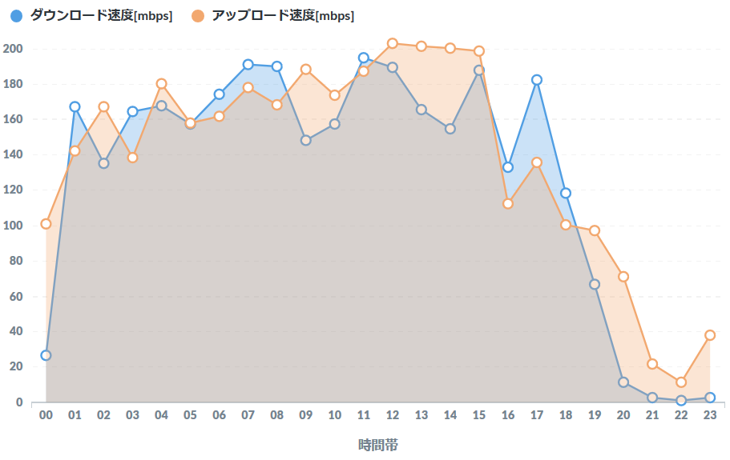

# speedtest

自宅の回線速度を自動で計測しデータベースに格納する  
[Metabase](https://www.metabase.com/)を使えば以下のようなグラフが簡単に描写できる



### 動作環境

- Ubuntu 16.04.6 LTS
- Python 3.6.3 :: Anaconda, Inc.
- psql (PostgreSQL) 10.7 (Ubuntu 10.7-1.pgdg16.04+1)

### Setup

1. PostgreSQL のインストール

   方法: https://qiita.com/eighty8/items/82063beab09ab9e41692

2. psycopg2 のインストール

   方法: https://qiita.com/tftf/items/4ad3f33bceb1db2dbe6f

3. speedtest-cli のインストール

   同梱済みであるため特に対処は必要なし  
   参考：https://qiita.com/CloudRemix/items/ad226ea4aa641427e682

4. データベース設定

   db_conf.jsonを作成し以下のように記載  
   ただし "linux-user" と "linux-password" はOS上のユーザとパスに読み替える
   ```
   {  
      "host"    : "localhost",
      "port"    : 5432,
      "dbname"  : "speedtest",
      "user"    : "linux-user",
      "password": "linux-password"
   }     
   ```
   参考: http://www.utsushiiro.jp/blog/archives/327

5. データベース・テーブル作成

   "linux-user" で以下を実行
   ```
   $ ./setup.py
   ```
   
6. CRON への登録

   crontab -e で以下の1行を追加
   ```
   5,15,25,35,45,55 * * * * cd <path to speedtest> && ./insert_speed.py
   ```

   実行頻度を上げすぎるとspeedtest-cliのサーバに迷惑をかけるので注意


7. BI ツールによる可視化
